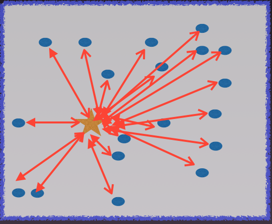
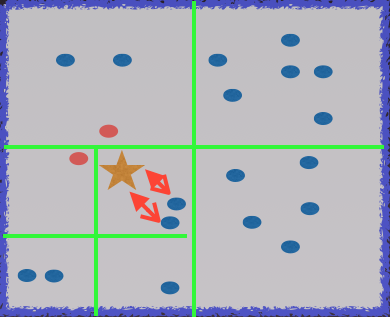

# k-Nearest Neighbors (kNN) algorithm for Apache Flink

For my Insight Data Engineering project, I coordinated with the Flink community and worked on the k-nearest neighbors algorithm developed by Chiwan Park found here:

https://github.com/chiwanpark/flink/tree/FLINK-1745/flink-staging/flink-ml/src/main/scala/org/apache/flink/ml/nn

I incorporated a quadtree data structure to improve the efficiency of the kNN query.

The brute-force approach to finding the k-nearest neighbors computes the pairwise distance for a given test point to all points in the training set



To reduce the number of distance computations needed for the kNN query, we partition the training set using a quadtree data structure.  Once a bounding box of the points has more than some specified value `maxPerBox` of points in the training set, the box is partitioned into equal sub-boxes; and once each sub-box has more than `maxPerBox` training points, it is further partioned, as demnonstrated by the green sub-boxes in the diagram:


The above picture of partitioning the training set into smaller sub-boxes is appealing, though there are some notable challenges in using the quadtree for the kNN query, namely the some of the k-nearest neighbors may no be in the minimal bounding box of the gold star.  For exmaple, the following digram shows red points in the training set that are closest to the test point:



A clean efficient way to search both in a test point's minimal bounding box *and* surrounding area is needed.  Defining the "surounding area" of a test point is the most delicate part.  The leaf-nodes of the quadtree are the only nodes containing a non-empty collection of objects in the corresponding rectangle, and the key to define the "surrounding area" is to construct a min-heap on the leaf nodes to select boxes that are closest to the test point.  

In Scala, the min-heap is defined on tuples of doubles and nodes of the tree
```scala
  val nodeQueue = PriorityQueue[(Double, Node)]
```
The `Double` of the tuple is defined as a suitable notion of the distance from a test point to a node, namely a method in the Node class is 
``` scala
   minDist(obj: DenseVector)
```
where `DenseVector` is a Flink data type corresponding the the object type.  The defining property of `minDist` is that every point inside the rectangle has distance to `obj` greater than `minDist`.  


## Running the kNN algorithm; Building Flink
First Flink needs to be built from Source, as this is a development brach of the Flink repo.  See the README.md file in the root directory of this repo.  I personally found it easieist to add on top of Flink by using IntelliJ
