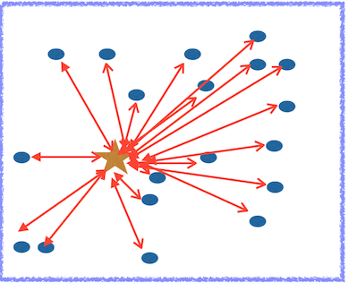
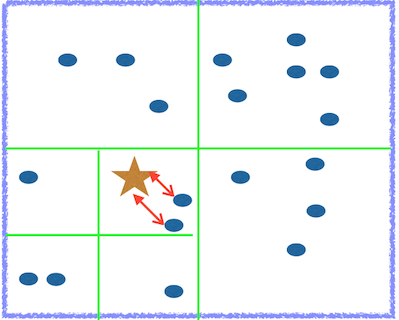

# Efficient k-Nearest Neighbors (kNN) algorithm using a quadtree for Apache Flink


Table of Contents:

1. [Introduction](README.md#1-introduction)
2. [Brute-force kNN](README.md#2-brute-force-knn)
3. [Distributed kNN](README.md#3-distributed-knn) 
5. [Distributed quadtree kNN](README.md#4-distributed-quadtree-knn)
5. [Other Remarks](README.md#5-other-remarks)

## 1. Introduction
For my Insight Data Engineering project, I coordinated with the Flink community and worked on the k-nearest neighbors (kNN) algorithm.  Apache Flink is a promising and rapidly growing data processing engine, and the philosophy behind Flink is to view both streaming and batch processing in a purely streaming framework


The result is lower latency and higher throughput than existing technologies.  In December of 2014, the Apache Software Foundation announced Flink a top-level project.  In Flink's JIRA page,
an exact kNN algorithm is labeled a major priority for the project, and initial progress was already made using a brute-force method found here
https://github.com/chiwanpark/flink/tree/FLINK-1745/flink-staging/flink-ml/src/main/scala/org/apache/flink/ml/nn

I coordinated with the Flink community to incorporate a quadtree to improve on what has already been done.  I made a pull request to merge my work on the kNN algorithm into Flink's master repo.

## 2. Brute-force kNN

The kNN algorithm is one of the fundamental classification algorithms, and has an endless amount of applications.  
Given a training set `A` and test set `B`, the kNN query can formally be stated as follows:  form the set `(b, A_b)` of tuples of points `b` in `B` and the k geometrically closest points `A_b` in `A` to `b`.  

The brute-force method computes the distance between a given test point and *all* the points in the training set


Even for a modest number of points -- e.g. 50,000 test and training points -- the brute-force method can take hours to run on a single CPU.  

## 3. Distributed kNN

The kNN algorithm lends itself to parallelization, which can help the brute-force method achieve better runtime to an extent.   The parallelization is done over the training set, namely the training set `A` is partitioned into `n` blocks `A_1, A_2, ..., A_n` and distributed across multiple nodes and CPUs.  Flink has a user-friendly notion of a DataSet, similar to Sparks RDDs, that allows for relatively straightforward parallelization of an algorithm.  

Each thread is given the full test set, and does a kNN query on a reduced training set `A_i`.  The k-nearest neighbors for each block `A_i` is then gathered to a single thread and the resulting `k*n` points are sorted to find the ultimate k-nearest neighbors

Details of this MapReduce style of distributing kNN can be found found here :

https://www.cs.utah.edu/~lifeifei/papers/mrknnj.pdf

## 4. Distributed quadtree kNN

Even when distributed, the brute-force approach to kNN can be time-consuming if each distributed block of the training set `A_i` is large due.  To reduce the complexity of the kNN query, a quadtree is formed for each block `A_i` of the training set. 

A quadtree is a dynamically constructed object on the training set, and one starts by forming a bounding box on the training set. Once the bounding box has more than some specified value `maxPerBox` of training set points, the box is partitioned into equal sub-boxes.  Once each sub-box has more than `maxPerBox` training points, it is further partitioned, as demonstrated by the green sub-boxes in the diagram.



The intuitive idea of partitioning the training set into smaller sub-boxes is appealing, though there are some notable challenges in using the quadtree for the kNN query, namely some of the k-nearest neighbors may not be in the minimal bounding box of the gold star.  The following diagram, for example, shows red points in the training set that are closest to the test point.


A clean efficient way to search both in a test point's minimal bounding box *and* surrounding area is needed.  Defining the "surrounding area" of a test point is in fact the most delicate part.  The leaf-nodes of the quadtree are the only nodes containing a non-empty collection of objects in the training set, and the key to defining the "surrounding area" of a test point is to construct a min-heap on the leaf nodes of the siblings belonging to the minimal bounding box in which a given test point lies in.


In Scala, the min-heap is defined on tuples of doubles and nodes of the tree
```scala
  val nodeQueue = PriorityQueue[(Double, Node)]
```
The priority -- i.e. the `Double` of the `(Double, Node)` tuple --  is defined as a suitable notion of the distance from a test point to a node, namely a method in the Node class is 
``` scala
   minDist(obj: Vector)
```
where `Vector` is a Flink data type.  The defining property of `minDist` is that every point inside the rectangle has distance to `obj` greater than `minDist`.  The definition of `minDist` can be found here:

http://www.cs.umd.edu/~nick/papers/nnpaper.pdf

## 5. Other Remarks

### Tests
Many tests and files used to benchmark the kNN algorithm can be found here:
https://github.com/danielblazevski/flink/tree/FLINK-1745-devel/flink-staging/flink-ml/src/test/scala/org/apache/flink/ml/nn

The benchmark files will be removed when the pull request is made to FLINK.

### Running the kNN algorithm; Building Flink
First Flink needs to be built from Source, as this is a development branch of the Flink repo.  See the README.md file in the root directory of this repo.  I personally found it easiest to add on top of Flink by using IntelliJ


### Link to presentations
Here are links for presentations about my project (github.io renders better, esp the tree edges on the slide titled "Challenge":

http://danielblazevski.github.io

http://www.slideshare.net/danielblazevski/dan-blazevski-insightdemo

